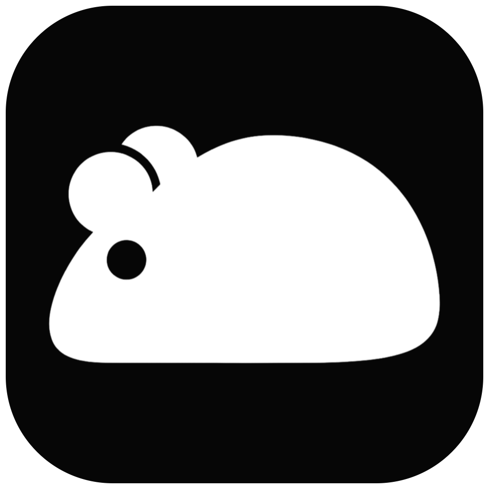
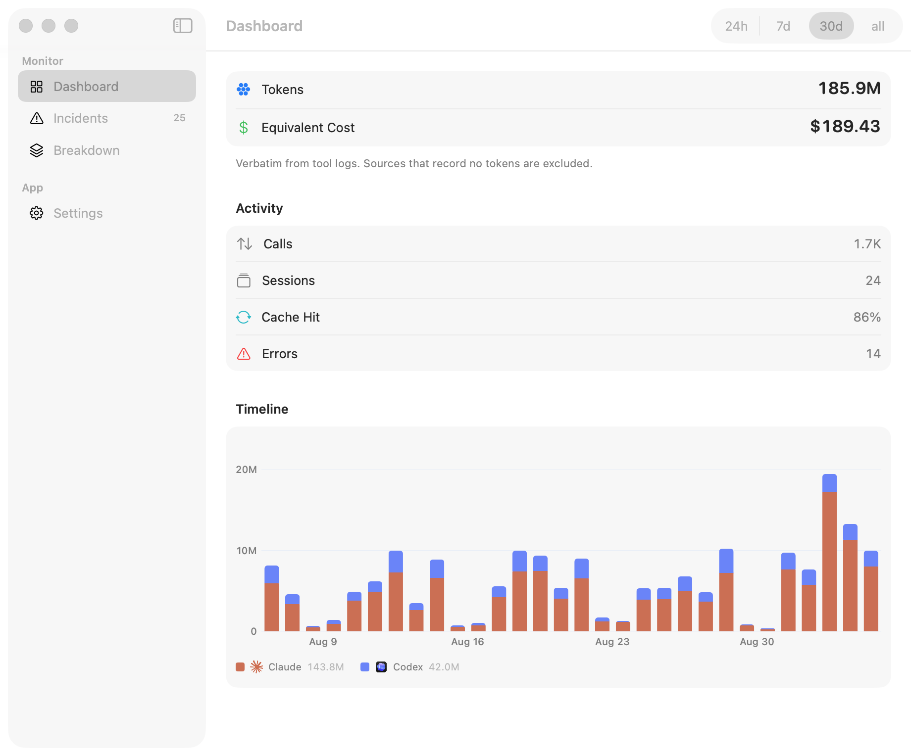
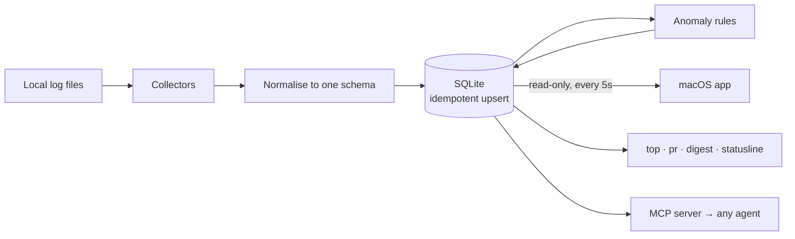

<div align="center">



# Vole

**Local-first usage, cost and security monitor for AI coding agents.**

[](https://github.com/launchsafe/vole/actions/workflows/ci.yml)
[](LICENSE)
[](#quick-start)
[](#quick-start)

</div>

Vole reads the logs your AI coding tools already write to disk, normalises them into one
schema, and surfaces both spend and *misbehaviour* — runaway tool loops, billable burn
spikes, retry storms, rate-limit pressure — plus the security picture: which AI surfaces
exist on this machine (including the ones nobody provisioned), whether a gateway is
rerouting a sanctioned agent to a different model, and what credentials are sitting in
the agents' own at-rest sinks.

It is a monitoring tool, not a cost tracker: the incident feed is the point.

Everything runs locally. No scraping, no cloud APIs, no logging into any web UI. No
prompt or tool content is ever stored — the content boundary is a branded type, and
`pnpm verify --content` checks the claim against the actual database.

```bash
git clone https://github.com/launchsafe/vole && cd vole && pnpm install
pnpm collect     # parse the logs, keep polling
pnpm app         # the menu-bar app
```

Supports **Claude Code**, **Codex CLI**, **OpenCode**, **Grok CLI**, **Cursor**, **Devin**,
**Antigravity**, **Gemini CLI**, **Copilot CLI**, **Aider**, **Goose**, **Amp**, **Continue**,
**VS Code chat / Cline / Roo / Kilo** and **Ollama**. Full setup, requirements and demo data in
[Quick start](#quick-start).



*Demo data (`pnpm seed`) — real logs are sparse and rarely fill a 30-day view this evenly.*

---

## Contents

- [Why this exists](#why-this-exists)
- [What is real, and what is not](#what-is-real-and-what-is-not)
- [The duplication trap](#the-duplication-trap)
- [Quick start](#quick-start)
- [The interface](#the-interface)
- [Command line and integrations](#command-line-and-integrations)
- [Anomaly rules](#anomaly-rules)
- [Cost model](#cost-model)
- [Verifying it works](#verifying-it-works)
- [Architecture](#architecture)
- [Known limitations](#known-limitations)
- [Contributing](#contributing)
- [License](#license)

---

## Why this exists

Developers now run several AI coding agents side by side. Each burns tokens independently, and
none of them tells you when one has gone wrong — stuck in a tool loop, retrying against a broken
API, or quietly re-reading the same 200K-token context forty times.

Existing tools answer *"how much did I spend?"*. Vole answers *"is anything going wrong
right now?"* — and shows you the spend as a side effect.

---

## What is real, and what is not

This is the most important section in this README. Different tools expose wildly different data,
and Vole never papers over the difference.

| Tool | Source on disk | Tokens | Cost | Badge |
|---|---|---|---|---|
| **Claude Code** | `~/.claude/projects/**/*.jsonl` (sessions and their subagents) | **Exact** | **Exact** | `exact` |
| **Codex CLI** | `~/.codex/sessions/**/rollout-*.jsonl` | **Exact** | *unavailable* | `exact` |
| **OpenCode** | `~/.local/share/opencode/opencode.db` (`message` table) | **Exact** | **Exact** (OpenCode's own, per provider) | `exact` |
| **Grok CLI** | `~/.grok/logs/unified.jsonl` (`shell.turn.inference_done`) | **Exact** | *unavailable* (no xAI rate) | `exact` |
| **Devin** | `~/Library/Application Support/Devin/User/acp-messages/*.db` | **None recorded** | none | `no tokens` |
| **Cursor** | `~/.cursor/ai-tracking/ai-code-tracking.db` | **None recorded** | none | `no tokens` |
| **Antigravity** | `~/.gemini/antigravity-ide/brain/<id>/` | **None recorded** | none | `no tokens` |
| **Gemini CLI** | `~/.gemini/tmp/<session>/stats.json` (cumulative meter) | **Exact** | *unavailable* | `exact` |
| **Copilot CLI** | `~/.copilot/sessions/**.jsonl` (`session.shutdown modelMetrics`) | **Exact** | *unavailable* | `exact` |
| **Aider / Goose / Amp / Continue / VS Code chat / Cline / Kilo / Ollama** | each tool's own session/task artifacts | **None recorded** | none | `no tokens` |

### Why each one is what it is

**Claude Code — exact.** Its JSONL transcripts record per-response `input_tokens`,
`output_tokens`, `cache_read_input_tokens`, and cache creation already split by TTL
(`ephemeral_5m` / `ephemeral_1h`). That split is what lets Vole compute cost *exactly*
rather than approximately. Subagents (the Agent tool, workflows) write their own transcripts
under `<project>/<session>/subagents/…`, tagged with the parent session id; Vole walks the tree so
that spend is counted too — on the development machine it was 16% of all messages.

**Codex — exact tokens, unknown cost.** Rollout logs emit `token_count` events carrying both a
cumulative `total_token_usage` and a per-turn `last_token_usage`. Vole derives usage from
the *delta of the cumulative counter* — summing the cumulative field would double-count
catastrophically, and the per-turn field alone over-counts because Codex sometimes emits the same
event twice. Cost renders as `—` because no published per-token rate for `gpt-5.1-codex-max` is
loaded.

> **Exact tokens do not imply known cost.** The UI keeps those two ideas separate rather than
> printing `$0`.

**Cursor — no token data exists locally.** `ai-code-tracking.db` was inspected directly: it has
*no token columns at all*. It stores code-hash attribution (which code came from which
model/request) to power Cursor's "% AI-written code" feature, and `state.vscdb` holds no usage
keys either. Cursor's token accounting lives server-side behind its account, which this project
will not touch. Its rows carry real models, sessions and timestamps with `NULL` tokens.

> Estimating Cursor tokens from lines of code was considered and **rejected**. It would be a
> fabricated number wearing an "estimated" badge — exactly the failure mode the confidence system
> exists to prevent.

**Antigravity — activity only.** Two hard constraints: it is a flat-rate subscription product that
exposes no client-readable per-token usage, and its conversation payloads (`conversations/*.pb`)
are high-entropy **encrypted** blobs — byte inspection shows no parseable protobuf wire format.
The plaintext artifacts under `brain/<id>/` prove a conversation happened, so Vole emits one
`activity_only` row per conversation with `NULL` tokens. It does **not** multiply a turn count by
a guessed constant — that would be a fabricated number.

**OpenCode — exact, cost included.** `~/.local/share/opencode/opencode.db` stores every assistant
turn as one `message` row whose `data` JSON carries `cost`, a `tokens` object split into
input / output / reasoning / cache read+write, the model and provider ids, per-turn timestamps and
the working directory. Keyed on the message id, so re-reading the table each poll is idempotent.
Cost is OpenCode's own figure — it prices every provider it supports, so a free local model shows a
genuine `$0`, not an unknown. Tool names come from the `part` table, a failed provider call (the
message carries an `error`) counts as an error, and a subagent's child session is folded into its
parent session with `agent_id = <agent>:<child id>`, so a session's spend is one tree.

**Grok CLI — exact tokens, cost unknown.** `~/.grok/logs/unified.jsonl` logs one
`shell.turn.inference_done` line per model call with `ctx.{prompt_tokens, cached_prompt_tokens,
completion_tokens, reasoning_tokens}` — the OpenAI-style shape. `prompt_tokens` includes the cached
part and `completion_tokens` includes reasoning, so `total = prompt_tokens + completion_tokens`,
fresh input is `prompt_tokens − cached_prompt_tokens`, and cache-read is `cached_prompt_tokens`.
Model and cwd come from each session's `summary.json`. No xAI rate is loaded, so cost is `—`.
`shell.tool.exec_done` names each tool the previous call asked for, and `shell.turn.inference_failed`
is a call that returned an error with no usage: it is stored as an `activity_only` row with
`is_error = 1`, so retry storms on Grok are visible without inventing a token count.

**Devin — activity only.** Devin's editor stores its ACP conversation under
`acp-messages/<uuid>.db`, but the payloads are pure content — no usage, token or model field
exists. Devin's agent runs on Cognition's servers and its accounting stays there, like Cursor. Vole
emits one `activity_only` row per agent turn, `NULL` tokens. (The editor also bundles the
`claude-code` extension; those runs are already covered by the Claude Code collector and not
double-counted.)

### The two confidence levels

There is no "estimated" tier, by policy. A token count is either measured or it is absent —
never guessed.

- **`exact`** — read verbatim from the tool's own logs. `total_tokens` is a plain sum of real
  usage fields (or, for Codex, a delta of the tool's own cumulative counter).
- **`activity_only`** — the call happened; the tool records no tokens locally (Cursor, Antigravity).
  The token fields are genuinely `NULL`, and these rows are **excluded from every token and cost
  aggregate** while still counting as calls.

`pnpm verify` independently re-derives every stored Claude Code and OpenCode row from its source
and requires an exact match.

---

## The duplication trap

Claude Code writes the **same API response to its transcript more than once**. Measured on real
logs: ~18K raw usage records collapse to ~7.5K unique `message.id` values.

**Summing rows naively inflates every number by ~2.4×.**

Vole keys each event on `claude_code:<message.id>` under a `UNIQUE` constraint, so every re-scan is
idempotent and the polling loop is safe by construction.

The copies are **not** always byte-identical: the first is written mid-stream with
`output_tokens: 0` and no `stop_reason`, then rewritten complete. So the collector coalesces the
occurrences it sees each pass down to the fullest one, and the insert is an upsert that upgrades an
already-stored placeholder when a later copy carries more tokens — it never downgrades, so
re-reading identical data stays a no-op. `pnpm verify` reconciles every stored row against the
fullest copy in the logs and reports the live duplication factor.

---

## Quick start

Vole is a **collector** (Node) that parses the logs into `~/.vole/vole.db`, and a native
**macOS app** (SwiftUI) that reads that database. A packaged `Vole.app` (built with
`pnpm app:bundle`, or downloaded as a release) embeds the collector as a self-contained binary
and starts it itself — nothing else to run. Building and running from source with `pnpm app`
(unbundled, `swift run`) doesn't have that binary, so it needs the collector started separately,
below. Requires **Node ≥ 22** and **pnpm** either way, plus **Xcode 26** for the app. Built and
tested on **macOS 26.5 (arm64)**.

```bash
git clone https://github.com/launchsafe/vole
cd vole
pnpm install
```

### 1. Collect

Only needed for `pnpm app` (unbundled). A packaged `Vole.app` runs this itself — see below.

Parses every source into `~/.vole/vole.db` and runs the anomaly rules.

```bash
pnpm collect:once     # one pass, prints a full summary to the console
pnpm collect          # continuous polling every 5s — this is the actual monitor
```

While polling, a **desktop notification** fires for every new `warn`/`critical` incident whose
window is less than 15 minutes old. On macOS this comes from the Vole app itself, if it's running
(so Notification Center shows the Vole icon); on Linux the collector sends it via `notify-send`.
A first scan over months of history stays silent. Pass `--no-notify` to turn the Linux path off.
One bad pass (a locked file, a disk hiccup) is logged and the loop carries on.

### 2. The app

```bash
pnpm app              # swift run — the menu-bar app, no bundling
pnpm app:bundle       # build/Vole.app, release build, ad-hoc signed, and open it
```

The app lives in the menu bar (no Dock icon until you open the dashboard window) and re-reads the
database every few seconds — no server, no port, no browser. A bundled `Vole.app`
(`pnpm app:bundle`, or a downloaded release) launches its own embedded collector on startup and
stops it on quit; `pnpm app` (`swift run`, unbundled) has no binary to embed, so it just reads
whatever `pnpm collect` (above) is writing. Details, packaging and the `--dump` headless check are
in [apps/mac/README.md](apps/mac/README.md).

### Updating

The app updates itself. When a release publishes a checksummed archive, the red-dot toolbar icon
and Settings → Software Update offer a one-click install: download, **verify the published
SHA-256**, validate the payload is really Vole at the advertised version, swap the running bundle
in place, and relaunch. A release without a checksum never silent-installs — the button falls back
to opening the release page, because unverifiable code is not swapped into a running app. For
private-repo distribution, store a GitHub token as `vole-github-token` in the login keychain
(`security add-generic-password -s vole-github-token -a vole -w <token>`).

### Demo data

Real logs are sparse and never trigger the error-storm or rate-limit rules, so a demo on live data
alone shows a thin incident feed.

```bash
pnpm seed         # 30 days of synthetic history, exercises the rules
pnpm seed:purge   # removes every seeded row
```

Seed rows are written with `source='seed'`; collectors only ever write `source='live'`. The app
shows a **Demo Data** badge whenever seed rows exist (it charts live rows only), and purge is a
single `DELETE ... WHERE source='seed'`. Live data is never touched.

**Detection is partitioned by source**, so seeded rows and live rows never share a statistical
baseline — demo data cannot redefine what "normal" means for your real usage.

---

## The interface

### The menu-bar panel

The menu-bar item shows live tokens for the chosen range (or cost, or just the mark), tinted
red or orange while an incident is open in the last hour. Click it for the panel: tokens and
equivalent value, a sparkline of the last 24 buckets, per-tool bars, and the range picker. At that
size it answers *"is anything wrong, and how hard are we going?"* and nothing else.

If the collector is not running the panel says so, with the command to copy. If it ran but has not
checked in recently, a banner says when it was last seen — "quiet" and "collector down" are
different states and the app never confuses them.

### The dashboard window

The signature element is the **incident-annotated timeline**: tokens stacked per tool in each
tool's brand colour, with every incident pinned to the bucket where its rule fired (severity-coloured
marks at the plot base, plus a clickable incident lane beneath that jumps to the filtered incident
list), so a spike and its cause are one glance rather than a chart and a list to correlate by hand.
Quiet days render as zero buckets, never as missing ones. Around it: the security-first KPI row
(AI surfaces, gateways, unsanctioned, rerouted models), the activity row (tokens, equivalent value,
burn rate, peak minute), the incident feed grouped by day with the exact figures that fired each
rule, per-tool model generation speeds with their provenance, and a sortable breakdown per tool and
model with the confidence badge on every row. Light and dark follow the system or a setting; the
palette is the system one, so it tracks the user's accent and contrast preferences.

Navigation is three groups — **Monitor** (Dashboard, Breakdown), **Risk** (Incidents, Triage,
Shadow AI, Data Exposure, Posture, Blast Radius, Behaviour) and **Manage** (People, Privacy,
Settings) — where every section names its data: a section whose backing table is absent (a later
tier's collector) renders an honest "written by Tier N" state rather than an empty list.

### The security screens

**Shadow AI** — the census of every AI surface on this machine: installed apps (with signing
Team IDs), persistent launchd gateways, CLIs, ghost apps that ran here and were deleted, local
model runtimes with listening ports, the OS's own AI settings, browser AI-host visit counts,
editor and browser extensions, and provider credentials (names and shapes only, never values).
Each row carries an evidence ladder — present / ran here / configured / listening — and states
"inventory, never spend". With a `~/.vole/policy/surfaces.json` declaration, rows gain
sanctioned/unsanctioned verdicts and an `unsanctioned_surface` rule fires; with no policy loaded,
the rule is inert by design — "unsanctioned" is a company decision, not a technical fact.

**Data Exposure** — the secret-sighting ledger: a versioned detector pack (AWS, OpenAI, Anthropic,
GitHub, private keys, entropy-with-stopwords) scanned out-of-path over the agents' own at-rest
sinks (Claude's shell snapshots and file history, Codex thread history, Copilot sessions, Devin
payloads). Sightings store a Keychain-keyed HMAC fingerprint and a byte offset — **never the
value**: the just-in-time evidence viewer re-reads the file at view time, so "no content stored"
survives a secret scanner living inside the product. Coverage denominators print beside every
figure.

**Triage** — the incidents screen the app never had: a queue with multi-select
acknowledge/mute/escalate, written through a spool directory (`~/.vole/inbox`) that the collector
drains — the app never writes the store, keeping the single-writer discipline. Mutes expire.

**Privacy Center** — the field dictionary (every table and column, from `PRAGMA` — the complete
answer to "what is stored on this machine"), the no-content claim, and the store facts.

### Model generation speeds

Per-model tokens/second, computed from response durations with per-figure provenance: OpenCode
states real spans (`measured`); Claude Code, Codex and Grok are estimated from turn gaps
(`turn_scoped` — a lower bound, since gaps include queue time). Every figure prints its coverage:
the share of that model's output tokens whose duration is known. A speed without its coverage
is a benchmark, not a measurement.

### Beyond the window

The richer views built this month — live sessions with the context gauge and prompt-cache
countdown, the per-session drill-down with the subagent cost tree and "what grew the context",
the period digest, and the what-if repricing — live in `packages/core` and are reachable from the
terminal and from any agent over MCP (next section). Porting them into the app is the top item on
the [roadmap](docs/ROADMAP.md).

---

## Command line and integrations

Everything the app knows, and the views it does not draw yet, from the terminal — across every tool.

```bash
pnpm top                 # htop for agents: live sessions, context vs window, tok/min, cache countdown, flags
pnpm pr                  # markdown table of agent usage on the current git branch, for a PR description
pnpm digest              # "your agent week" as markdown (--range=24h|7d|30d|all, --json)
pnpm statusline          # one line for a status bar (reads Claude Code's status-line JSON, or --session=<id>)
pnpm mcp                 # stdio MCP server over the same queries
```

`pnpm pr` attributes by working directory inside the repo since the branch diverged from the default
branch, so it covers every tool; only Claude Code records the branch name itself, and that exact
count is printed as a footnote rather than used as the filter.

**Status line.** Claude Code pipes a JSON object with `session_id` to the status-line command, so:

```json
{ "statusLine": { "type": "command", "command": "pnpm --silent --dir /path/to/vole statusline" } }
```

prints `vole · ctx 412K/1M 41% · $3.20 · 1.2K tok/min · cache 2:40 · ! 1 warn` for the session you
are in. Any other tool can call it with `--session=<id>`.

**MCP.** `pnpm --silent --dir /path/to/vole mcp` speaks newline-delimited JSON-RPC on stdio, with no
dependencies, and exposes `vole_summary`, `vole_live_sessions`, `vole_session`, `vole_incidents`,
`vole_breakdown`, `vole_whatif` and `vole_digest`. An agent can ask what its own session has cost,
how full its context is, and whether Vole has flagged it — which makes cost-aware agents possible.
Register it wherever you run agents:

```bash
# Claude Code
claude mcp add vole -- pnpm --silent --dir /path/to/vole mcp
```
```toml
# Codex: ~/.codex/config.toml
[mcp_servers.vole]
command = "pnpm"
args = ["--silent", "--dir", "/path/to/vole", "mcp"]
```
```json
// OpenCode: opencode.json          // Cursor: ~/.cursor/mcp.json
{ "mcp": { "vole": { "type": "local", "command": ["pnpm", "--silent", "--dir", "/path/to/vole", "mcp"] } } }
{ "mcpServers": { "vole": { "command": "pnpm", "args": ["--silent", "--dir", "/path/to/vole", "mcp"] } } }
```

Nothing leaves the machine: the server reads the local database and answers on stdout.

---

## Anomaly rules

Rules are pure functions over event arrays, unit-tested without a database. Each firing writes its
own row so the dashboard can render an incident feed.

| Rule | Fires when |
|---|---|
| `billable_burn_spike` | A 10-min window costs >**3×** that session's typical window — scored on `cost_usd` where priced, else uncached tokens; cache-read-only spikes never fire |
| `repeat_call_loop` | ≥**45 calls** in 5 min while output stays flat — an absolute rate, so a session spinning at a constant speed from its first turn is caught (the old relative-median rule missed it by construction) |
| `error_storm` | >20% error ratio over 15 min, with ≥5 errors |
| `rate_limit_pressure` | Codex reports >80% of its quota consumed (the only tool that self-reports this) |
| `context_pressure` | A call carried ≥80% of the model's context window (≥95% critical); once per session per hour |
| `rerouted_model` | A Claude Code row was answered by a non-Anthropic model id — read straight from the stored model column, with the CCR hex-alias decoded (a "claude-ccr-h7177…" id that decodes to the qwen model actually serving) |
| `unsanctioned_surface` | A census surface is not in the loaded policy declaration — **inert when no policy is loaded** |
| `new_ai_surface` | A surface first seen within the last 24h |
| `coverage_degraded` | A source root that exists can no longer be read — a permission fact, not an absence fact |
| `foreign_root` | Usage recorded with a cwd that does not exist on this filesystem — the transcript came from another machine |

Rules are also **epoch-aware**: when the rule registry changes, every new rule sees the
historical rows once, instead of silently waiting for the next insert.

`context_pressure` uses the window the tool reports (Codex) or the published one for first-party
model ids in `pricing.json`. An OpenCode `provider/model` id resolves only for the `anthropic`
provider, since a proxy provider may cap the window; anything unknown is skipped, never guessed.

Two design details that matter:

**Baselines are leave-one-out.** A window is compared against the median of *all other* windows.
With a plain median, a lone spike drags up the very baseline it is measured against and hides
inside it — especially with sparse data.

**Loop detection needs two signals.** High call volume alone also describes a productive burst.
The distinguishing signature of a stuck agent is many calls where *output stays flat while cache
reads climb* — it keeps re-reading the same context and producing nothing.

---

## Cost model

Cost is **equivalent API value at list price** — what this usage *would* have cost through the
API. On a subscription plan you are not billed per token, and the UI says so.

```
cost = ( input·I + write5m·I·1.25 + write1h·I·2 + cacheRead·I·0.1 + output·O ) / 1e6
```

Rates are data, not code: [`packages/core/src/data/pricing.json`](packages/core/src/data/pricing.json),
versioned with `effective_from`. A per-installation `~/.vole/pricing.json` (or `$VOLE_PRICING`)
merges over it, so new models can be added without a release:

| Model | Input $/MTok | Output $/MTok |
|---|---|---|
| `claude-fable-5-1`, `claude-fable-5` | 10.00 | 50.00 |
| `claude-opus-5`, `claude-opus-4-8` | 5.00 | 25.00 |
| `claude-sonnet-5` | 2.00 | 10.00 |

Cache multipliers on base input: read **0.1×**, 5-minute write **1.25×**, 1-hour write **2×**.
A model may override the read rate with a flat `cache_read` $/MTok (Fable 5.1 reads at 0.25).
Dated snapshot ids (`claude-haiku-4-5-20251001`) price as their alias.

Rows stored before their model had a rate are priced retroactively the next time the collector
starts, so adding a model to `~/.vole/pricing.json` reprices history, not just future calls.

Unknown or unpriceable models return `NULL`, never `0`. That includes `<synthetic>`, a real Claude
Code entry type representing a message with no billed API call.

---

## Verifying it works

```bash
pnpm test               # unit tests: rules, queries, bucketing, confidence invariants
pnpm verify             # reconciles every stored row against its own source record
pnpm verify --content   # the no-content claim, checked against the actual database
pnpm verify --surfaces  # the inventory/usage firewall: surface rows never trace to usage
pnpm parity             # the two readers (TS and Swift) must answer identically
```

`pnpm verify` is the important one. It:

- re-implements the cost formula **independently**, so a bug in the product's own pricing module
  cannot cancel itself out;
- compares **per record** rather than comparing totals — totals drift continuously while a session
  is live, so a total-vs-total check can neither prove nor disprove correctness;
- anchors Codex on the source's own **cumulative meter**: a stored total must equal the meter
  delta, and breakdown fields must be NULL (not 0) where the source never split the meter;
- **fails on an empty store** and opens read-only — a vacuous PASS can never happen;
- reports pruned sources (Claude deletes transcripts after ~30 days) as a horizon, not a failure;
- checks every `activity_only` row is NULL in all token and cost fields;
- reports the live duplication factor.

`pnpm verify --content` turns "we never store prompts" from a promise into a check: every table
and column must be in a reviewed allowlist, and every free-text value must match its writer's
shape — a pasted prompt cannot hide in a triage note.

`pnpm parity` builds a deterministic fixture store, runs both independent readers (TypeScript
`queries.ts` and Swift `DB.swift`) against it, and diffs the JSON — the same drift-catching
contract CI enforces on every push, including the schema-version handshake between the collector
and the app.

Expected output (one section per source):

```
  [claude] reconciled per-message  7583
  [claude] token mismatches        0
  [claude] cost mismatches         0
  [opencode] token mismatches      0
  [codex] reconciled per-event     53
  [codex] token mismatches         0
  [codex] breakdown mismatches     0
  [no-token] fields not NULL       0

  PASS — every stored row matches its source record.
```

If that final line ever changes, something is genuinely wrong.

---

## Architecture

```
packages/core     types · SQLite schema + migrations · pricing · collectors · scanners · DLP ·
                   rules · queries · CLIs · MCP · policy
apps/mac          SwiftUI menu-bar app + dashboard window, reading the same SQLite file read-only
```

`packages/core` is plain TypeScript with no UI imports — that is what lets the collector, the
seeder, the verifier, the CLIs and the MCP server share one implementation. The app has no
Node runtime: `DB.swift` ports the read models from `queries.ts` onto the SQLite3 C API that ships
with macOS, and `pnpm parity` + CI enforce that the two agree on every push.

Schema changes go through a **numbered, ledgered migration path** (`schema_migrations`, currently
v14): an older binary refuses to write a newer store loudly instead of silently NULLing columns it
does not know, and the app renders a version-gate banner rather than guessing. Expensive discovery
work (the AI-surface census, the DLP scan engine) runs on a **scanner cadence lane** — every
5–10 minutes, never inside the 5-second poll — and the collector supervises itself with a
verified pidfile so crashed launches cannot accumulate.



### Documentation

Full documentation lives in [docs/](docs/README.md), and is also available as a single
**[combined PDF](docs/Vole-Documentation.pdf)** (46 pages, with bookmarks) for offline
reading or sharing:

| Guide | For |
|---|---|
| [ARCHITECTURE.md](docs/ARCHITECTURE.md) | Module map, schema DDL, idempotency contract, how the app reads the store |
| [DATA-SOURCES.md](docs/DATA-SOURCES.md) | What every tool writes to disk, with real samples and traps |
| [DEVELOPMENT.md](docs/DEVELOPMENT.md) | Setup, commands, debugging recipes, testing philosophy |
| [EXTENDING.md](docs/EXTENDING.md) | Add a tool, a rule, a model rate, or a panel in the app |
| [DECISIONS.md](docs/DECISIONS.md) | How it was built, and the five bugs that shaped it |
| [ROADMAP.md](docs/ROADMAP.md) | Ranked next steps, plus good first issues |
| [ENTERPRISE-ROADMAP.md](docs/ENTERPRISE-ROADMAP.md) | Where the product is going: 368 features in 8 tiers |
| [MARKET.md](docs/MARKET.md) | Why companies buy this, and the 62-vendor competitive picture |

Regenerate the PDF after editing any markdown with `pnpm docs:pdf`.

---

## Known limitations

- **Codex and Cursor data may be stale.** On the development machine, Codex data was ~9 months old
  and Cursor ~4 months. Both parsers are real and correct, but they contribute history rather than
  live activity unless you actively use those tools.
- **`is_error` covers API errors only** (`isApiErrorMessage`). Failed *tool* results inside a turn
  are not yet correlated back to the assistant message that issued them, so `error_storm`
  under-counts on live data.
- **Antigravity timing is approximate** — file mtimes, not real timestamps, so its events cluster
  rather than spread across a session.
- **`pnpm app:bundle` ad-hoc signs.** `bundle.sh --release` signs with a Developer ID, notarises
  and produces a `.dmg` plus the checksummed auto-update pair — see
  [apps/mac/README.md](apps/mac/README.md#package).
- **Generation speeds for Claude Code, Codex and Grok are turn-scoped estimates** — the gap from
  input to completed response, which includes queue time, so they are lower bounds on true
  streaming speed. OpenCode rows are measured. Every figure prints which it is.
- **Cursor and Antigravity coverage is **deliberately shallow** because the data genuinely is not
  there. That is documented rather than disguised.
- **Context windows are known only for first-party model ids** listed in `pricing.json`
  (`context_windows`) or reported by the tool itself (Codex). Local and proxied models show a
  context size but no window, and never trip `context_pressure`.
- **The enterprise tiers are in progress.** 111 of the 368 roadmap features are built (all
  blockers, Tier 1, Tier 2 and Tier 4); identity (Tier 3), the tool-call ledger (Tier 5), posture
  (Tier 6), SIEM export (Tier 7) and fleet (Tier 8) are the remaining direction — see
  [ENTERPRISE-ROADMAP.md](docs/ENTERPRISE-ROADMAP.md). Sections whose backing tables do not
  exist yet say so in the app instead of showing empty lists.

---

## Contributing

Contributions are welcome — see [CONTRIBUTING.md](CONTRIBUTING.md) for setup, the pre-PR checks,
and the two rules ("never invent a number," "every collector is idempotent") that shape every
review here. Bugs and feature requests go in
[issues](https://github.com/launchsafe/vole/issues); [ROADMAP.md](docs/ROADMAP.md#good-first-issues)
has ranked next steps and good first issues.

Bugs and feature requests: please open an [issue](https://github.com/launchsafe/vole/issues).

---

## License

MIT — see [LICENSE](LICENSE).
